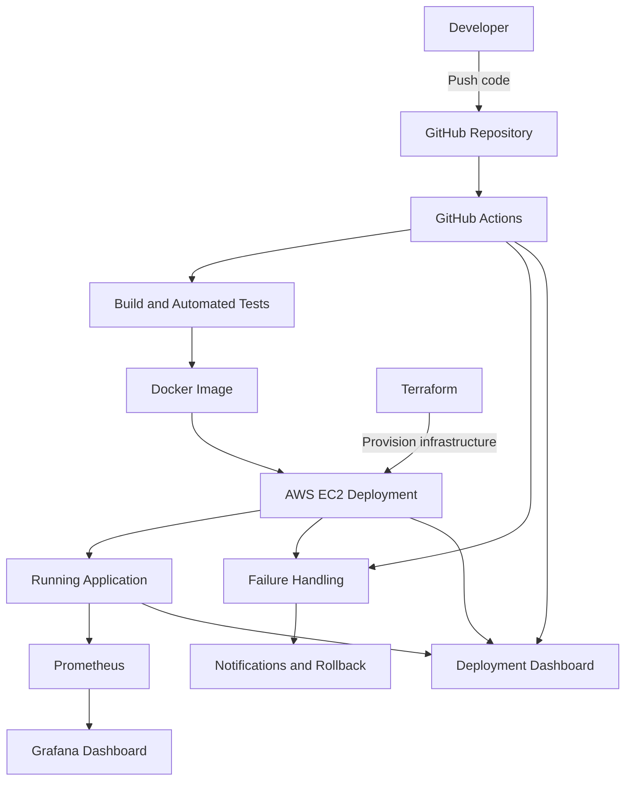

# PipelinePilot – Proposed System Architecture

```mermaid
flowchart TD
    A[Developer] -->|Push code| B[GitHub Repository]
    B --> C[GitHub Actions]
    C --> D[Build and Automated Tests]
    D --> E[Docker Image]
    E --> F[AWS EC2 Deployment]
    F --> G[Running Application]

    T[Terraform] -->|Provision infrastructure| F

    G --> H[Prometheus]
    H --> I[Grafana Dashboard]

    C --> J[Failure Handling]
    F --> J
    J --> K[Notifications and Rollback]
    
    G --> L[Deployment Dashboard]
    C --> L
    F --> L
```
